
<h1><u>Présentation des services Web</u></h1>

---

+ **Dans cette conférence, je vais vous présenter ce que sont les services Web, `les deux différents types de services Web et les deux normes Java différentes qui traitent ces deux services Web`.**

 

+ **`Les services Web` sont des applications `client-serveur` ou fournisseur grand public qui communiquent sur le réseau via le protocole `http` et échangent des messages ou des données au format `XML` et dans divers autres formats comme `JSON`.**

 

+ **Ils assurent `l'interopérabilité entre les applications logicielles`, ce qui signifie que les applications logicielles exécutées ou développées dans différents langages de programmation peuvent communiquer entre elles quelle que soit la plate-forme sur laquelle elles s'exécutent.**

 

+ **Une application Java exécutée sur un environnement `Linux` peut communiquer avec une application `.NET ou Python` exécutée dans un environnement `Windows`.**

 

+ **Ils permettent de développer des `applications de manière faiblement couplée`, c'est-à-dire que deux applications ou plus peuvent communiquer entre elles ou peuvent être intégrées de manière faiblement couplée.**

 

+ **`L'application A` qui utilise aujourd'hui les services de `l'application B` via des `services Web` peut facilement passer à `l'application C` pour obtenir les mêmes fonctionnalités que celles que `l'application B` lui fournissait de manière très faiblement couplée sans changer beaucoup de code.**

 

+ **Nos `clients` peuvent `étendre nos applications via des services Web`. Ils peuvent intégrer les produits internes que vous possédez ou les produits d'une autre entreprise avec le produit que nous leur vendons via les services Web que nous exposons. Ils peuvent proposer leur propre logique en consommant nos webservices.**

 

+ **Nous pouvons également développer des `applications mashup` qui peuvent consommer `plusieurs services Web`. Par exemple, alors que je travaillais sur un produit de gestion de projet chez Oracle, nous avons développé un petit mashup de démonstration qui extrayait les informations d'un projet routier. base de données des applications de gestion via les services Web, puis il a appelé `les services Web de Google Maps pour tracer la progression des travaux routiers sur la carte Google`.**

 

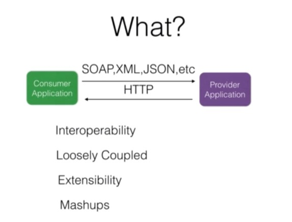

+ **Il existe deux types ou types différents de services Web.**

    + **Le premier concerne les grands `services Web ou les services Web SOAP` qui utilisaient des `messages SOAP basés sur XML` sur la méthode de publication `http`.**

      + **Ainsi, dans ce cas, `le fournisseur de services Web et le consommateur` communiquent en utilisant `SOAP` qui est un fichier `XML`, puis ils utilisent la publication `http` pour effectuer cet échange de messages.**

    + **Deuxièmement, `les services Web RESTFUL` encore plus puissants qui utilisent pleinement la méthode `http`, c'est-à-dire qu'ils utilisent toutes les méthodes disponibles dans le protocole `http` en standard et prennent ensuite en charge `plusieurs formats de données`, c'est la grande fonctionnalité des `services Web RESTFul avec XML`. ils prennent en charge `JSON, TEXT, etc`.**

 

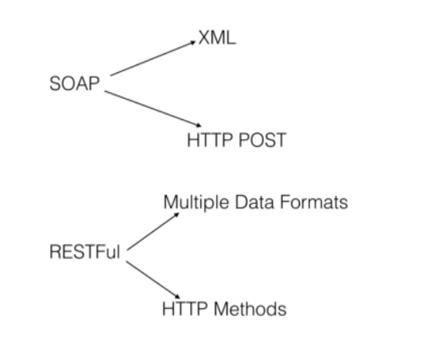

+ **Chaque langage et plateforme possède des standards pour implémenter ces deux types de `webservices`. Ils nous fournissent des outils pour implémenter `les webservices SOAP ainsi que RESTFUL`.**

  + **Dans le monde Java, `JAXWS est la norme pour la mise en œuvre de services Web basés sur SOAP`. `JAX-WS` signifie `JAVA API pour les services Web basés sur XML`.**

  + **Deuxièmement, `JAX-RS` est un standard pour la mise en œuvre des `services Web RESTFul`. `JAX-RS`, comme vous pouvez le deviner, signifie `Java-API pour les services Web RestFul`.**

+ **En tant que développeurs, nous maîtriserons ces deux standards pour implémenter nos services Web. Les concepts des services `SOAP et RESTFul` et ces deux standards sont présentés en détail respectivement dans la première et la seconde moitié de ce cours.**

 

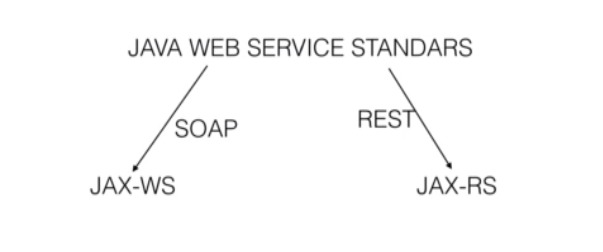

# Quizz

---

#### **Question 1**
+ **Quels sont les avantages des `services Web`:**
    
    + Interopérabilité
    + Couplage faible
    + Extensibilité
  
#### **Question 2**
+ **Les deux standards Java pour implémenter les services web `SOAP` et `REST` sont :**

    + JAX-WS et JAX-RS

#### **Question 3**
+ **Les deux types de services `Web` les plus courants sont :**

    + SOAP et REST

<h1><u>SOA and Web Services:</u></h1>

---

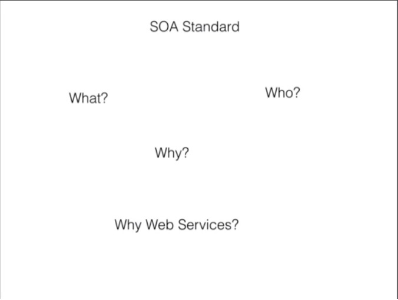

 

+ **À partir de cette conférence, vous apprendrez ce qu'est la `SOA`, pourquoi nous en avons besoin, qui gère la norme `SOA` et pourquoi `les services Web sont une technologie si clé à mettre en œuvre`.**

 

+ **`SOA` est un `ensemble de principes architecturaux` pour concevoir et implémenter nos applications logicielles de telle manière qu'elles soient composées de plusieurs logiciels
   des services dotés d'interfaces simples et bien définies et pouvant s'utiliser les uns les autres de manière `faiblement couplée`.**

 

+ **Le standard `SOA` est maintenu par des organismes ouverts comme le `W3C et OASIS` qui proposent les principes architecturaux que nous utiliserons ensuite dans nos applications pour `construire, concevoir et implémenter` nos applications afin qu'elles bénéficient de tous les avantages de la `SOA`. que vous verrez sous peu. Ces organisations sont formées par des personnes de `Microsoft, Oracle, IBM, etc`.**

 

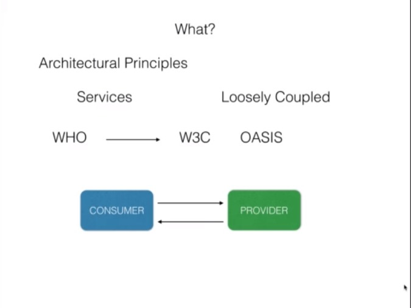

 

+ **Semblable aux services Web, la `SOA` a deux rôles, `le rôle de fournisseur et le rôle de consommateur`. Le prestataire fournit un service et le consommateur le consomme. Le fournisseur d’un service peut être le consommateur d’un autre service. Définissons donc ce qu'est un service selon la norme `SOA` à l'aide d'un exemple `d'application de gestion hospitalière`.**

 

+ **Un service selon `SOA` est une `implémentation d'une logique métier qui fonctionne indépendamment de l'état d'un autre service`. Voici une application de gestion hospitalière dans laquelle nous disposons d'un service de gestion des rendez-vous qui permet à un patient de prendre rendez-vous avec un médecin.**

 

+ **`Ce service de gestion des rendez-vous` utilise `le service patient` pour obtenir les informations sur le patient, puis le `service médecin` pour obtenir l'horaire du médecin et prendre rendez-vous. De même, `le Service Médecin` consomme un `Service Clinique` qui lui fournit les données d'un patient particulier. Ce sont les données cliniques d'un patient. De même, nous disposons d’une application Bed Management qui peut être utilisée pour attribuer un lit si un `patient` est en cours d’enregistrement.**

 

+ **Tous ces composants ne sont pas regroupés en une seule application mais ils sont séparés en services et déployés indépendamment. Ils communiquent entre eux dans une passion vaguement couplée en utilisant une interface standard.**

 

+ **Cela signifie que tant que cette `interface` entre `le Service Médecin et le Service Clinique` reste la même, nous pouvons remplacer ce `Service Clinique` particulier par un nouveau `Service Clinique` que nous écrivons. Ou si l'hôpital achète un service clinique auprès d'une autre entreprise, il peut l'utiliser tant que le contrat entre ces deux sociétés reste le même.**

 

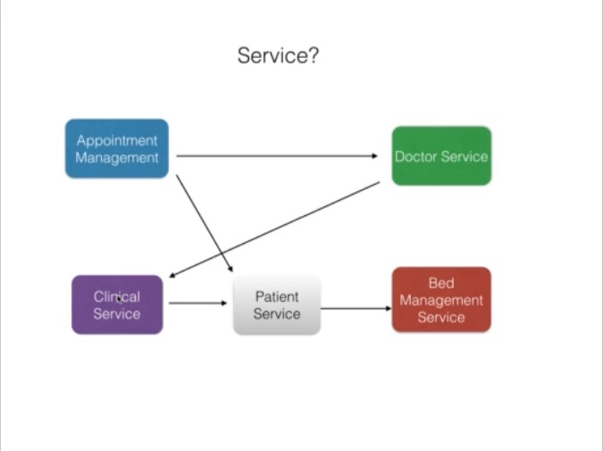

 

+ **Ce contrat, dans le cas des `services Web SOAP` est le fichier `WSDL` et dans le cas des `services REST`, il s'agit du fichier `WADL`.**

 

+ **Le format de données utilisé pour échanger des messages entre ces services dans `SOA est XML` car `XML` contient à la fois `des données et des métadonnées` qui indiquent quoi faire avec ces données. Examinons quelques-uns des avantages de la SOA.**

 

+ **Et au fur et à mesure que nous les parcourons, vous constatez que `les services Web` présentent à peu près les mêmes avantages et c'est la raison pour laquelle les services Web sont les clés pour mettre en œuvre la `SOA`.**

 

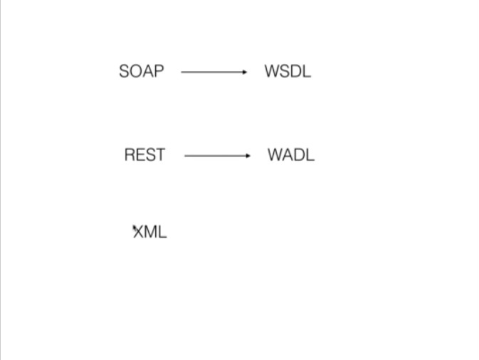

 

+ **Le premier avantage est l’indépendance de la plateforme. Autrement dit, les applications SOA doivent pouvoir s'exécuter sur plusieurs plates-formes et ils peuvent communiquer entre eux.**

 

+ **Donc, si une application exécutée sur un environnement `.NET ou Linux` ou un environnement `Windows` peut facilement communiquer ou devrait facilement communiquer avec un service exécuté sous `Linux qui est écrit en Java`.**

 

+ **`SOA` permet aux développeurs de se concentrer sur leur rôle afin de pouvoir se spécialiser dans un domaine. Pour revenir à notre exemple précédent, un ensemble de développeurs peut se spécialiser dans une `application de gestion de médecins`, un ensemble de développeurs peut se concentrer sur un « service de gestion de lits », un `service de gestion clinique`, etc. Couplage faible que j'ai déjà expliqué.**

 

+ **Tant que l'interface reste la même, une application ou un service consommateur d'un autre service peut facilement être basculé vers un autre service offrant les mêmes fonctionnalités car nous utilisons des `interfaces standard et faiblement couplées`.**

 

+ **Puisque nous avons divisé `les services ou l'application en plusieurs services`, si nous avons besoin d’une fonctionnalité particulière, nous pouvons facilement la réutiliser dans notre application.**

 

+ **Par exemple, `Google` utilise `SOA` d’une très bonne manière. Lorsque vous utilisez `Google Mail, Google Drive et Google Docs`, lorsque vous consultez vos e-mails, vous ouvrez votre e-mail et s'il contient une pièce jointe qui est un `document Word ou une feuille Excel`, `Google` vous permet d'ouvrir cette feuille `Excel ou Word`. documenter via `Google Docs`, qui est un service complètement différent.**

 

+ **Ensuite, si vous souhaitez enregistrer ce fichier sur votre lecteur Google, vous pouvez facilement le faire. Ce sont donc tous des services différents auxquels on accède chaque fois que cela est nécessaire. Les coûts diminuent grâce à la réutilisation.**

 

+ **Nous pourrons réutiliser une grande partie de notre application au lieu de tout reconstruire où et quand cela sera nécessaire, nous pourrons simplement consommer un service qui est déjà là.**

 

+ **`L'évolutivité`, qui est une fonctionnalité importante dont chaque application a besoin aujourd'hui en raison du nombre d'utilisateurs qui utilisent nos applications. À mesure que le nombre d'utilisateurs augmente, nous pouvons simplement faire évoluer notre service ou déployer notre service, un service particulier sur plusieurs serveurs et les utilisateurs de notre application qui utilisent ce service, même le nombre n'a pas d'importance.**

 

+ **Au fur et à mesure que cela se chiffre en millions, nous faisons simplement évoluer notre application ou déployons nos services sur plusieurs serveurs et notre application est accessible aux utilisateurs finaux. Cette évolutivité s'accompagne de la disponibilité.**

 

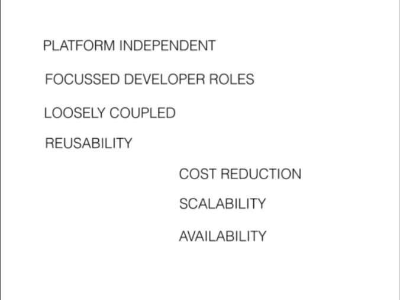

 

+ **Au fur et à mesure que nous déployons l'application sur `plusieurs serveurs`, notre application est désormais `plus fiable` et si un serveur tombe en panne, les consommateurs de notre service peuvent toujours faire appel à nos applications exécutées sur les autres serveurs.**

 

+ **Avant les `services Web`, il existait plusieurs technologies comme `DCOM pour le monde .NET, CORBA, JAVA RMI, Messaging` qui tentaient de résoudre le problème de `SOA` mais elles ne pouvaient pas s'en approcher car il n'y avait aucun moyen de communiquer avec une `interface standard ou une interface indépendante` de la plateforme.**

 

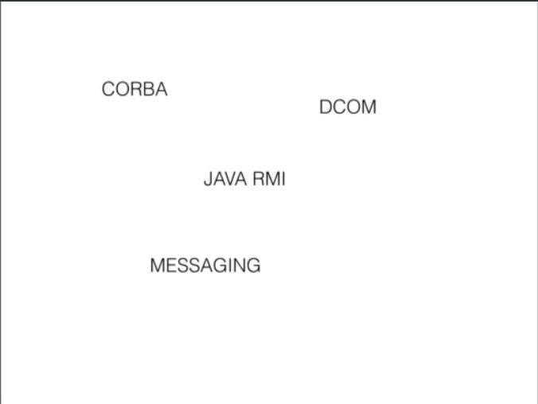

 

+ **Mais les `services Web`, d'un autre côté, en raison de `leur évolutivité, de leur interopérabilité et de leur indépendance de plate-forme`, sont devenus une technologie clé pour mettre en œuvre une architecture orientée services.**

 

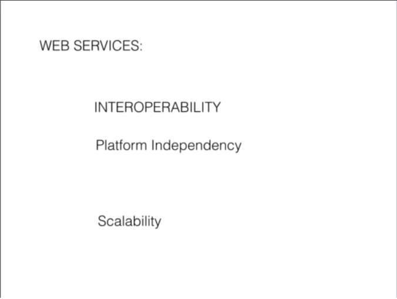

 

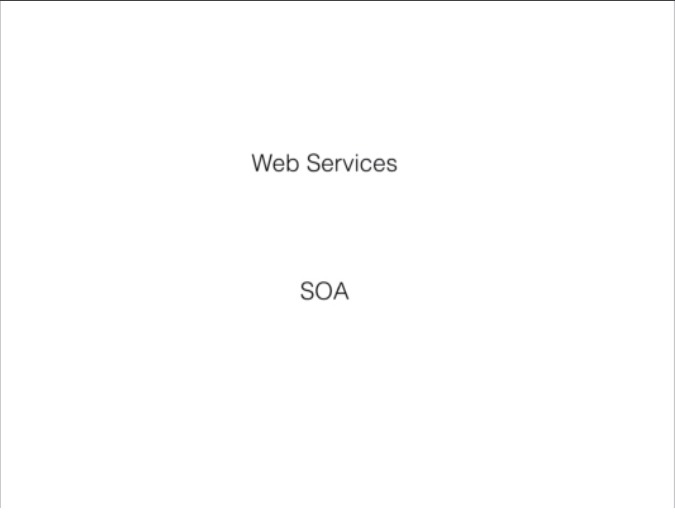

 

+ **Au fur et à mesure que vous parcourez les autres conférences et implémentez vos services Web, vous verrez tous ces avantages un par un.**

 

+ **Pour résumer, cette conférence vous a appris que `SOA (Service Oriented Architecture)` est un ensemble de principes et que `les services Web` sont un moyen de mettre en œuvre ces principes dans nos applications que nous créons.**

# Quizz

---

#### **Question 1**

+ `SOAP` et `Web Services`: une seule même chose.

#### **Question 2**

+ Quels sont les avantages de la `SOA` ?

  + Flexibilité et évolutivité
  + Adaptabilité et couplage faible
  + Indépendance de la plateforme

<h1><u>Summary</u></h1>

+ **Dans cette conférence, on résume cette `section d'introduction aux services Web`.**

 

+ **Vous avez commencé par dire que `les services Web` sont des applications de fournisseur grand public qui peuvent être écrites dans plusieurs langues et exécutées sur différentes plates-formes pouvant communiquer entre elles.**

 

+ **`Les services Web` utilisent le protocole `http` et utilisent généralement le `XML` comme format de données pour `échanger les messages`.**

 

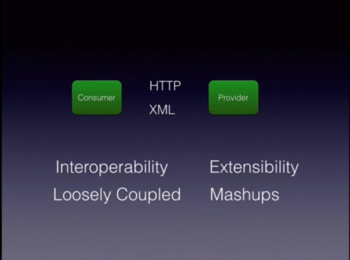

 

+ **Les avantages de l'utilisation des `services Web` sont :**

   + **`Interopérabilité`, c'est-à-dire que les applications exécutées sur des plates-formes hétérogènes ou sur différents types de plates-formes peuvent communiquer entre elles.**

   + **Deux, ils sont faiblement couplés et utilisent des services Web. Nous pouvons créer des applications `faiblement couplées` qui peuvent utiliser une application aujourd'hui ou consommer un `service Web` aujourd'hui et demain s'il souhaite passer à un autre service Web qui fournit un service similaire, nous pouvons facilement le faire.**

   + **Extensibilité**
  
     + **Nous pouvons étendre un produit et même le personnaliser en utilisant les services Web proposés par un produit particulier.**

   + **`Mashups`, nous pouvons créer une seule `application mashup` en utilisant plusieurs `services Web` différents disponibles au sein d'une entreprise ou sur Internet.**

 

 

+ **Il existe deux types de services Web ou technologies de services Web, à savoir `SOAP et REST`.**

 

+ **La norme pour la mise en œuvre de services Web basés sur `SOAP` dans le monde `Java` est `JAXWS`, qui signifie JAVA API pour les services Web basés sur `XML`.**

 

+ **De même pour `REST`, il s'agit de` JAXRS` - API Java pour les services Web basés sur `XML`.**

 

+ **Vous avez également appris que `SOA` est un ensemble de principes architecturaux permettant de créer des applications `faiblement couplées`.**

 

+ **`SOA` est maintenu par des organismes ouverts comme le` W3C` et des personnes de diverses organisations comme `Microsoft, Oracle, IBM, etc`.**

 

+ **Dans le monde `SOA`, un service est une implémentation d'une logique métier qui fonctionne de manière autonome.**

 

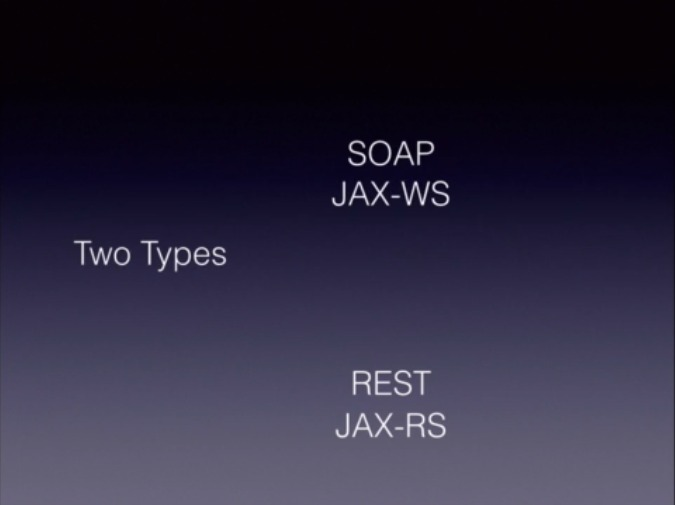

 

+ **`XML` est le format de données utilisé par ces services.` SOA et les services Web` offrent les mêmes avantages.**

 

+ **`Les services Web Infact` sont l'un des moyens par lesquels la SOA peut être mise en œuvre.**
    